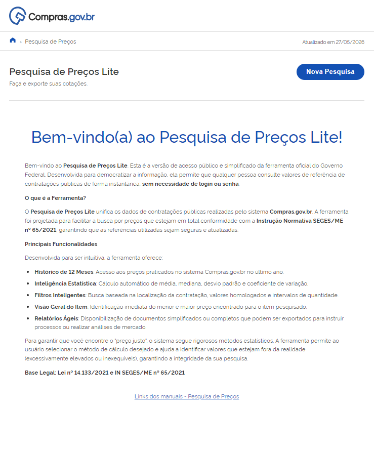
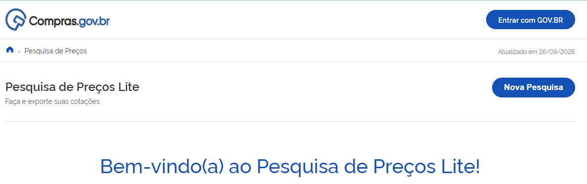
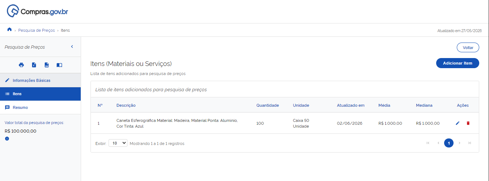
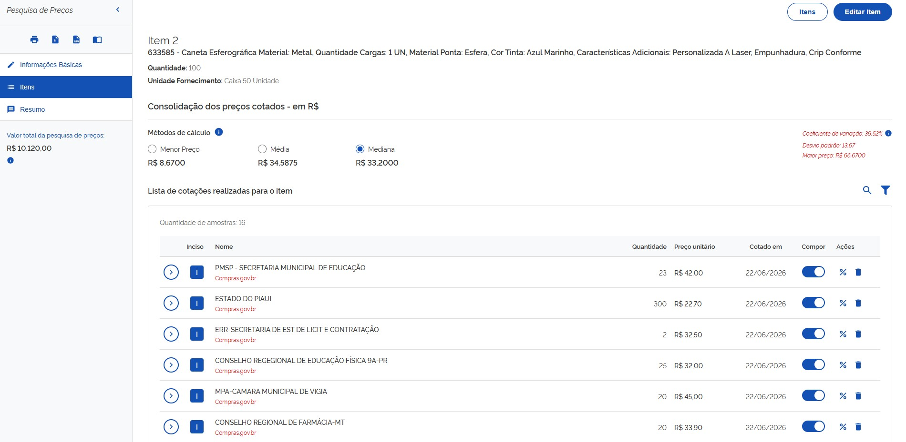
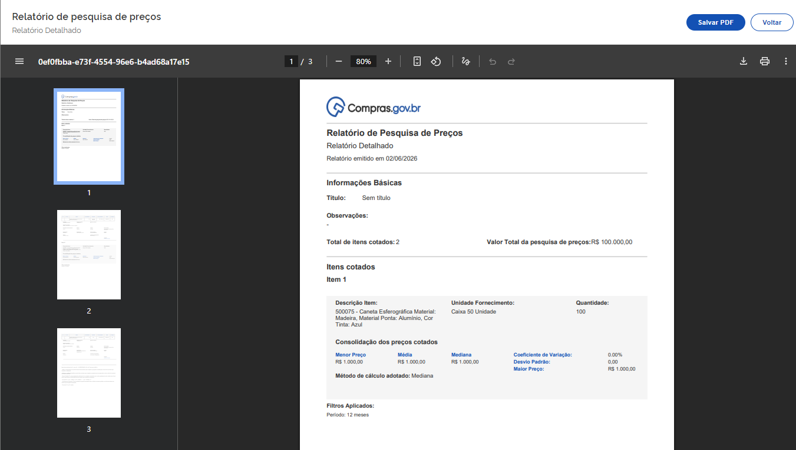
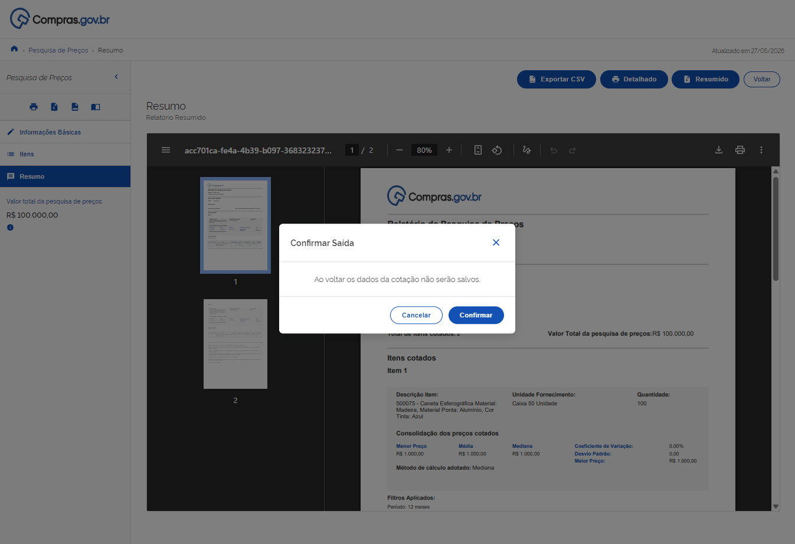

 Tamanho do texto:
 <button onclick="diminuirFonte()" title="Diminuir texto" style="padding: 6px 12px; font-weight: bold; cursor: pointer; border: 1px solid #ccc; border-radius: 4px; background: #f8f9fa;">A-</button>
 <button onclick="resetarFonte()" title="Tamanho normal" style="padding: 6px 12px; font-weight: bold; cursor: pointer; border: 1px solid #ccc; border-radius: 4px; background: #f8f9fa;">A</button>
 <button onclick="aumentarFonte()" title="Aumentar texto" style="padding: 6px 12px; font-weight: bold; cursor: pointer; border: 1px solid #ccc; border-radius: 4px; background: #f8f9fa;">A+</button>
 
 <button onclick="window.print()" style="background-color: #0056b3; color: white; padding: 6px 16px; border: none; border-radius: 5px; font-size: 14px; cursor: pointer; box-shadow: 0 2px 4px rgba(0,0,0,0.2); margin-left: 10px;">
 🖨️ Imprimir ou baixar esta página
 </button>

PÚBLICO-ALVO: SERVIDORES E GESTORES

# Pesquisa de Preços Lite — Manual Completo

O **Pesquisa de Preços Lite** é uma solução moderna e simplificada voltada para a elaboração rápida de pesquisas de preços no âmbito das contratações públicas federais. Este manual reúne todas as orientações necessárias para realizar desde o primeiro acesso até a emissão de relatórios e exportação de dados.

---

# ACESSO E LOGIN

**Passo 01:** Acesse o sistema Pesquisa de Preços Lite pelo endereço oficial e clique em **“Entrar com Gov.br”**.

**Passo 02:** Na tela de autenticação do Gov.br, insira seu CPF e clique em **“Avance”**.

**Passo 03:** Digite sua senha cadastrada no Gov.br e clique em **“Entrar”**.

**Passo 04:** Após a autenticação, o sistema direcionará para a página inicial do Pesquisa de Preços Lite. Clique no botão **“Nova Pesquisa”** para iniciar uma consulta.

**Passo 05:** Se você optar por utilizar o sistema sem realizar o login, a tela inicial exibirá o alerta para entrar com a conta Gov.br, a fim de garantir a gravação do seu histórico.

**Passo 06:** Para consultar pesquisas finalizadas anteriormente, acesse o menu **“Minhas Pesquisas”**. Serão exibidas as consultas vinculadas à sua conta Gov.br com opções para visualizar ou continuar o preenchimento.

---

# INICIANDO E ADICIONANDO ITENS

**Passo 07:** Preencha as informações básicas da consulta, como título e observações, e clique na aba **“Itens”**.

**Passo 08:** Na opção **“Itens”**, clique no botão **“Adicionar Item”** para incluir o material ou serviço que deseja pesquisar.

**Passo 09:** No campo de texto, descreva de forma resumida o item que deseja pesquisar e selecione a opção mais adequada: **Material** ou **Serviço**.

!!! note "Nota"
    O sistema mostra as opções do catálogo do Compras.gov.br. Os itens que aparecem com a letra **M** antes do nome correspondem aos materiais e aqueles com a letra **S** são serviços. 
    
    *Exemplo:* Ao pesquisar "Computador" (material), o sistema exibirá `"M - Computador"`. Ao pesquisar "Manutenção de Computador" (serviço), será exibido `"S - Manutenção de Computador"`.

**Passo 10:** No painel de consulta, selecione o item que melhor atende à sua necessidade, assim como a quantidade, a unidade de fornecimento e as características necessárias para refinamento da pesquisa. Após preencher os campos, clique na opção **“+”** para incluir o item na lista de pesquisa.

---

# EDIÇÃO DE ITENS E ANÁLISE ESTATÍSTICA

**Passo 11:** Caso deseje alterar a pesquisa, clique em **“Editar item”** (ícone de lápis) ou **“Excluir Itens”** (ícone de lixeira vermelha) na coluna “Ações”.

**Passo 12:** Após clicar em **“Editar item”**, abrirá a tela de edição. No topo da página, o sistema exibe as informações oficiais do catálogo do sistema Compras.gov.br (CATMAT para materiais ou CATSER para serviços) a respeito do item selecionado:

* **Descrição do Item:** Mostra o código e a descrição padronizada (*Ex.: 500075 - Caneta Esferográfica Material: Madeira*).
* **Quantidade e Unidade de Fornecimento:** Indica a quantidade estipulada para a contratação e como o item é fornecido (*Ex.: Caixa 50 Unidade*).

**Passo 13:** Faça as alterações necessárias e clique em **“Aplicar”**. O sistema confirma a atualização das unidades de fornecimento ou quantidades, alertando que as cotações para aquele item serão atualizadas.

**Passo 14:** Confirme a alteração do item.

Pronto, a cotação para aquele item foi atualizada. Para atualizar os demais itens, basta seguir novamente as instruções dos Passos 11 e 12.

## Indicadores e Gestão de Amostras

O Pesquisa de Preços Lite exibe os seguintes indicadores em tempo real:

* **Métodos de Cálculo:** Permite visualizar e alternar o critério de obtenção do preço estimado entre **Menor Preço**, **Média** ou **Mediana**. O método selecionado influenciará diretamente no valor de referência calculated pelo sistema.
* **Painel de Controle Estatístico:** Localizado à direita, apresenta o Coeficiente de Variação, o Desvio Padrão e o Maior Preço encontrado na amostra, servindo de parâmetro para analisar a homogeneidade e a segurança dos dados.

O Pesquisa de Preços Lite também mostra a relação de contratações públicas que foram selecionadas para compor os preços. Além disso, é possível detalhar as informações a respeito das compras na seção **“Lista de cotações realizadas para o item”**. Ao expandir o registro, o usuário tem acesso completo às informações da compra, incluindo o número do processo, a modalidade de contratação (*Ex.: Dispensa*), os dados do fornecedor, marca do produto e o critério de julgamento.

!!! warning "Atenção"
    **Gerenciamento das Cotações:**
    É possível gerenciar as contratações que compõem a pesquisa de preços na tabela exibida:
    
    * Na coluna **Compor**, é possível ativar ou desativar aquela cotação específica. Quando a opção estiver desativada, o valor é excluído dos cálculos estatísticos.
    * Na coluna **Ações**, o ícone de lixeira exclui permanentemente o registro da lista do item.

---

# RESUMO, RELATÓRIOS E EXPORTAÇÃO

**Passo 15:** Após preencher os campos obrigatórios de identificação e escolher as cotações que farão parte da sua pesquisa, clique na aba **"Resumo"**.

Na página de Resumo será possível:

1. **Baixar e salvar o Relatório Resumido:** Para gerar o relatório resumido da pesquisa realizada em PDF, clique no botão **"Resumido"**.
2. **Baixar e salvar o Relatório Detalhado:** O relatório apresentará a média e a mediana dos últimos 12 meses, calculadas a partir das compras homologadas de todos os itens da consulta, junto com os dados de cada item. Para gerar em PDF, clique no botão **"Detalhado"**.

3. **Exportar os dados obtidos:** Caso prefira extrair os dados e salvá-los em formato editável no seu computador, clique em **"Exportar CSV"** no canto superior direito.
4. **Salvar a pesquisa na sua conta:** Para armazenar a consulta e acessá-la posteriormente, clique no botão **"Salvar Pesquisa"**. Se você já realizou o login Gov.br no início, o sistema confirmará o salvamento imediatamente. Caso ainda não tenha feito login, abrirá a tela de autenticação do Gov.br para vincular a pesquisa ao seu perfil.

!!! warning "Atenção"
    Ao clicar no botão "Home" ou em "Voltar" sem estar autenticado via Gov.br ou sem salvar a pesquisa, o sistema encerrará a consulta e os dados **não ficarão salvos**. 
    
    Para garantir que seu trabalho não seja perdido e possa ser recuperado a qualquer momento, utilize o botão **"Salvar Pesquisa"** com o login Gov.br antes de sair.

---

## Suporte e Atendimento

Caso tenha dúvidas ou precise de suporte, a Central de Atendimento do Ministério da Gestão e da Inovação em Serviços Públicos (MGI) está disponível:

* **Portal de Serviços:** Através do portal oficial
* **Telefone:** 0800 978 9001
* **Horário:** Segunda a sexta-feira, das 8h às 18h

 

 <button onclick="window.print()" style="background-color: #0056b3; color: white; padding: 10px 20px; border: none; border-radius: 5px; font-size: 16px; cursor: pointer; box-shadow: 0 2px 4px rgba(0,0,0,0.2);">
 🖨️ Imprimir ou baixar esta página
 </button>

